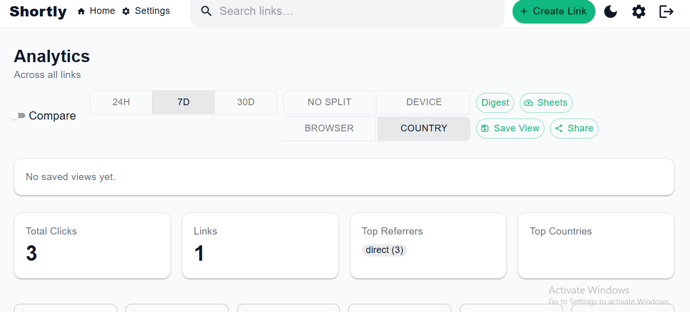
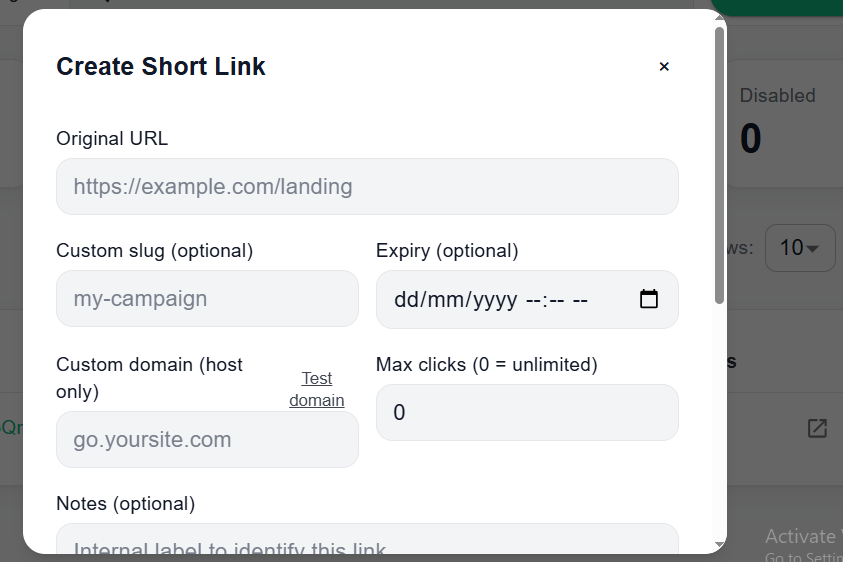
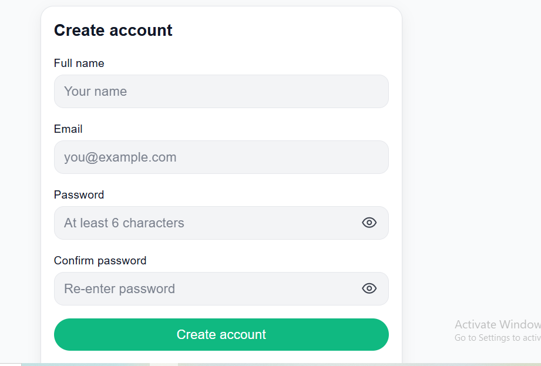
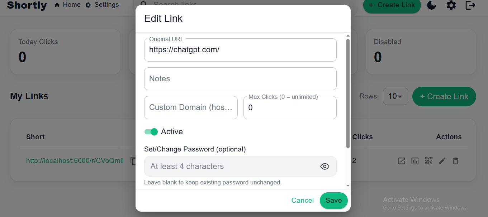
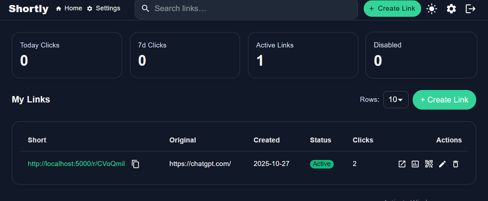
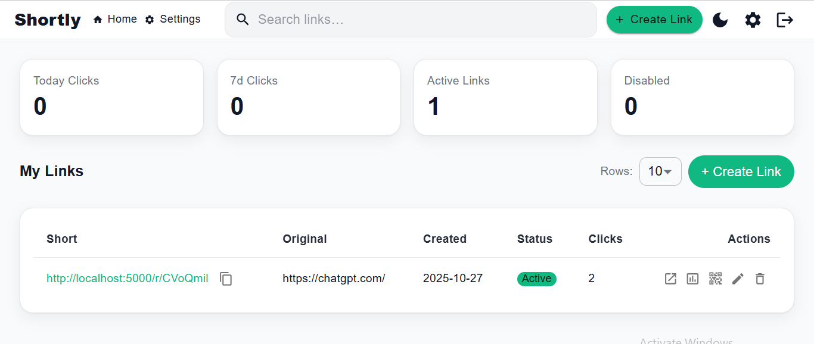
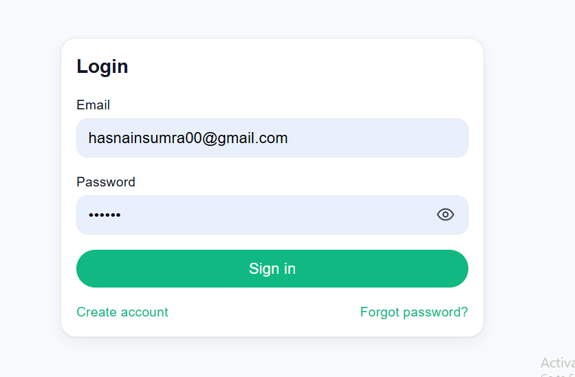
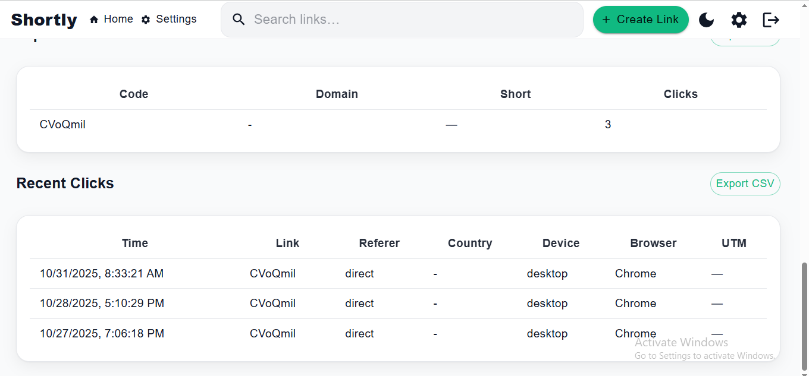

cat > README.md <<'EOF'
# 🔗 Shortly — Link Shortener & Analytics (MERN)

A production-ready link shortener with authentication, custom domains, QR codes, password-protected links, click analytics (time/device/browser/country), saved views, CSV export, and shareable analytics links.

---

## 🚀 Tech Stack

| Layer      | Technologies |
|-----------|--------------|
| Frontend  | React 18, Vite, MUI, Tailwind, React Router, Recharts, Axios |
| Backend   | Node.js, Express, MongoDB (Mongoose), JWT, BullMQ (optional), Nodemailer |
| Dev Tools | Git, VS Code, NPM |

---

## 📦 Project Structure

```text
shortly/
├─ client/             # React + Vite app
│  ├─ public/
│  │  └─ screenshots/  # README images live here
│  └─ src/             # components, pages, store, api
└─ server/             # Express API
   └─ src/             # routes, models, middlewares, utils
⚙️ Run Locally
Backend
cd server
cp .env.example .env   # or create .env
npm install
npm run dev
# API → http://localhost:5000

Frontend
cd client
cp .env.example .env   # or create client/.env
npm install
npm run dev
# Web → http://localhost:5173


client/.env

VITE_API_BASE=http://localhost:5000

🖼️ Screenshots 
| Page              | Preview                                                       |
| ----------------- | ------------------------------------------------------------- |
| Dashboard (Light) |        |
| Create Link       |      |
| Create Account    |   |
| Edit Link         |         |
| Home (Dark)       |  |
| Home (Light)      |             |
| Login             |            |
| Recent Clicks     |    |
| EOF               |                                                               |
